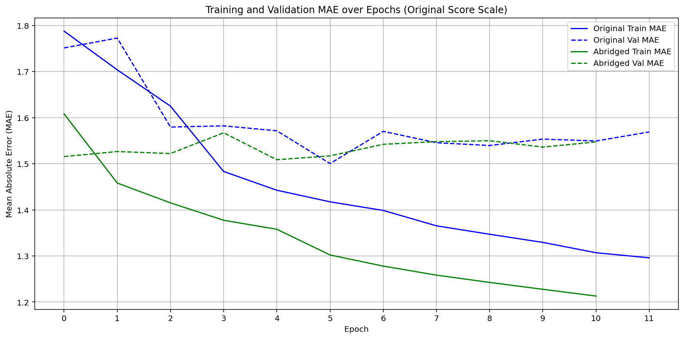

## Project Scope: 

Create an AI model that can evaluate short (less than 1800 words) typed essays.  
Create a simple website demo that can evaluate thesis statements.  
Create a website demo that can evaluate typed essays. 

## Project Details: With logical organization and clear but concise writeups.

### How AI Model was set up  
Used Keras Sequential models for text analysis using a Bidirectional LSTM (long short term memory).  
Removal of stop words (e.g. articles, conjunctions, prepositions), this helps the model focus only on the more important words in the essays. LSTM models are great for understanding patterns in text (like sentences) and so they're good for an application like this where we want to train a model to try to understand lots of text. Bidirectional LSTM means that the model reads the essays from both directions to increase understanding.  
Model has 4 hidden layers:
  - non-hidden layer: Embeddings with initial input
  - dropout: 20%
  - Bidirectional LSTM
  - Dense Relu
  - Dense regression output layer

Compiled using Adaptive Moment Estimation (adam), with loss determined by mean square error.

### How well did the Model Work

[Essay Introduction Evaluator](https://script.google.com/macros/s/AKfycbxRluQljBoN2PC1dW4iDnAkObKuLUhs7R7orDWjLOWQ7Kjl9WJb4yvy1V0dmwD0XWM/exec): initial model to evaluate single thesis statement.  
**Claude AI prompt:**   
Please generate a Google Apps Script (.gs) and an accompanying HTML file for a Google Apps Script Web App. The purpose is to help users create an introduction sentence for an essay based on one of the following historical prompts:
1. The Legacy of Columbus: How did Christopher Columbus's voyages impact both Europe and the Americas, and what are the lasting consequences of his actions?
2. The Industrial Revolution: How did the Industrial Revolution change society and the economy, and what were the positive and negative consequences of these changes?
3. The Rise and Fall of Rome: What factors contributed to the rise and eventual fall of the Roman Empire?
The web app should:
* Provide a dropdown menu for the user to select one of the prompts.
* Include a text input field where the user can write a one-sentence introduction for their essay.
* When the user clicks a “Check My Intro” button, it should send the selected prompt and the user’s introduction to an AI model (simulate this if necessary).
* The AI should evaluate how on-topic and relevant the introduction is compared to the selected prompt and return a numerical rating from 1 to 10, where 10 means perfectly on-topic and 1 means not relevant at all.
* Display the numerical rating clearly on the page.
If real AI integration isn't possible, simulate the evaluation with a simple keyword-matching heuristic or any placeholder logic. Use vanilla HTML (with basic inline styling if needed) and Google Apps Script for the backend logic.
Please return both the .gs file and the HTML file as separate code blocks.

[Essay Grader](https://script.google.com/macros/s/AKfycbzGV3livLefoWqqA5_ESHbr2LCdNVGhEmmOcsFRCfuj_8Xir6s-3nOGmptz_W9oUvQX/exec): expanded model to evaluate multi-paragraph essay.   
[New Essay Grader](https://script.google.com/macros/s/AKfycbxjCzwXN1V3rtfi9Em-WEuevVWTUA6250BULKthNIneI0MTOQw5tYvRKIfU1IeAz95ojw/exec)

**Claude AI prompt:** 

Can you create a website that grades essays based on topic and how well it is written.  Can you create this in two files: a HTML and .gs

## What are future developments?

Short Term Developments: Current model does not take into account the prompt that the essay is based upon. Adding this as a dummy code may improve model performance. 

Mid Term Developments: The model can be enhanced by integrating AI vision technology capable of reading and interpreting handwritten essays. This advancement would help minimize, or even eliminate, the impact of handwriting quality on grading accuracy. Additionally, it could serve as a tool to identify students who may need support in improving their handwriting, promoting more equitable assessments.

Long Term Developments: A fully tested and deployed AI essay grading system for handwritten AP essays could deliver significant benefits. These include reducing grading costs, eliminating potential human biases, and accelerating the turnaround time for score reporting. Furthermore, such a system could enable more personalized, constructive feedback for students—enhancing the overall educational experience.

## Responsible AI considerations

- fairness in grading
- fairness in scoring (through regular audits)
- diverse training set
- plagerism identification: correlation of essays may also need to be developed in future models.
- educators should have oversight to review and override scores generated by AI.
- Based on our objective of AP essay grading automation, the AI model may not be reasonable for use for lower ages. 
